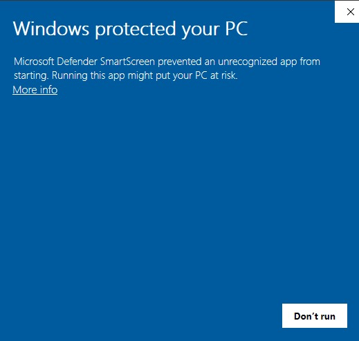
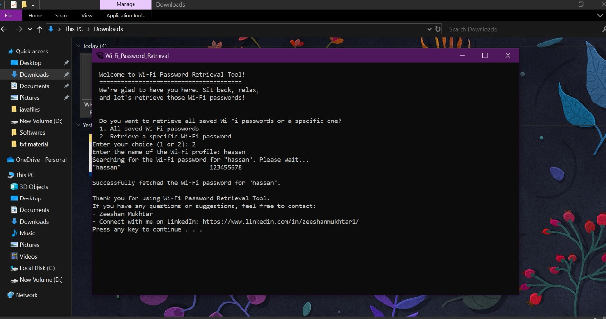

Wi-Fi Password Retrieval Tool

This tool allows you to retrieve Wi-Fi passwords saved on your Windows system. It provides an option to either retrieve all saved Wi-Fi passwords or a specific one by its SSID name.

Prerequisites

- Windows operating system
- Command Prompt (cmd.exe)

How to Run

1. Retrieve Wi-Fi Passwords

Our tool offers a streamlined and efficient way to access your saved Wi-Fi passwords. Here's how to make the most of it:

- Open Command Prompt (cmd.exe).
- Navigate to the directory containing the script `wifi_password_retrieval.bat`.
- Run the following command:
  wifi_password_retrieval_V2.bat
- You will be prompted with two choices:
  - Retrieve all saved Wi-Fi passwords.
  - Retrieve a specific Wi-Fi password by entering the SSID name.
- Select your desired option and follow the on-screen instructions.
  - If you choose to retrieve all passwords, the tool will list each saved Wi-Fi profile along with its password.
  - If you choose to retrieve a specific password, you'll be asked to enter the SSID name, and the tool will fetch the corresponding password.
- During the process, the tool will display messages to keep you informed, such as when it is searching for saved passwords.
- If no passwords are found, a clear error message will guide you on what to do next.

2. Retrieve Wi-Fi Passwords Using Executable (Optional)

Tired of running commands repeatedly? We've got you covered with an executable version of this tool, which is easy to use and lightweight (size in KBs only). Download it from [here](https://github.com/ZeeshanMukhtar1/Wi-Fi_Password_Retrieval/releases).

- Download the [executable file](https://github.com/ZeeshanMukhtar1/Wi-Fi_Password_Retrieval/releases).
- Run the downloaded executable file.
- Follow the on-screen instructions similar to the script.

**Note:** If your system displays a warning such as "Windows protected your PC" with a message that "Microsoft SmartScreen prevented an unrecognized app from running," click on "More info" and then "Run anyway." Don't worry, it's a simple and safe script.

Important Notes

- Ensure that you have administrative privileges to run these scripts or executables.
- If the script or executable prompts for user input, follow the instructions provided.
- For security reasons, do not share the retrieved passwords with unauthorized individuals.
- Use this tool responsibly and only on systems you own or have permission to access.

Credits

- Developed by [Zeeshan Mukhtar](https://github.com/zeeshanMukhtar1/)

License

This Script is licensed under the MIT License - see the LICENSE file for details.
