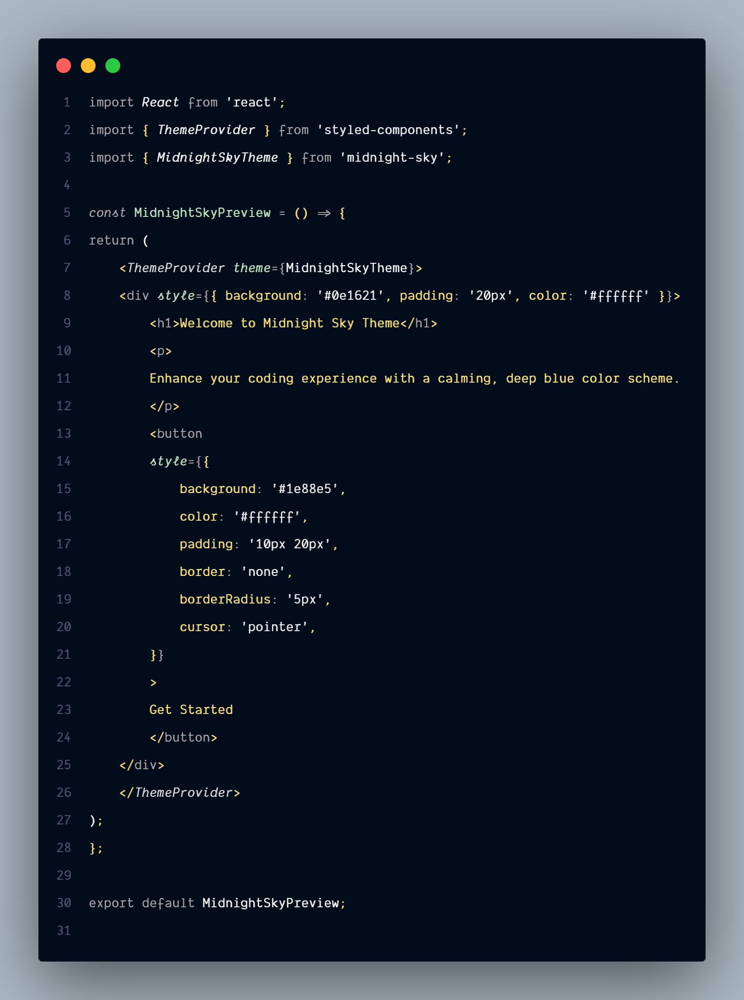

# Midnight Sky

A calming, deep blue theme for Visual Studio Code, perfect for late-night coding sessions.

## Index

- [Install](#install)
- [Theme Preview](#theme-preview)
- [Recommended Preferences](#recommended-preferences)
- [License](#license)
- [Designer](#designer)
- [Contributors](#contributors)

---

[](http://makeapullrequest.com)
[](https://github.com/zeeshanMukhtar1/midnight-sky/issues)
[](https://github.com/zeeshanMukhtar1/midnight-sky/blob/main/LICENSE)

## Install

You can install Midnight Sky via the [Visual Studio Code Marketplace](https://marketplace.visualstudio.com/items?itemName=MidnightSky.midnight-sky).

## Theme Preview



_Screenshot showcasing the Midnight Sky theme with JSX syntax highlighting._

## Recommended Preferences

```json
{
  "editor.fontFamily": "Dank Mono",
  "editor.fontLigatures": true,
  "editor.fontSize": 14,
  "editor.letterSpacing": 0.4,
  "editor.lineHeight": 2
}
```

## License

This extension is licensed under the [MIT License](LICENSE).

## Designer

Midnight Sky is designed and maintained by [Zeeshan Mukhtar](https://www.codewithzeeshan.me/).

---

## Contributors 💖

We welcome new contributors. Midnight Sky is a community-driven project, and we appreciate your help! To contribute, please read our [contributing guidelines](CONTRIBUTING.md).

<a href="https://github.com/ZeeshanMukhtar1/midnight-sky/graphs/contributors">
  
</a>
